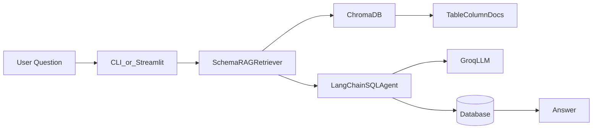

# SQL RAG Agent
A **text-to-SQL** assistant that answers natural-language questions about a database using **LangChain**, **Groq**, and open-source RAG with **Chroma** and **Hugging Face embeddings**.

## Table of Contents
- [Features](#features)
- [Architecture](#architecture)
- [Prerequisites](#prerequisites)
- [Quick Start](#quick-start)
- [Example User Flow](#example-user-flow)
- [Example Questions](#example-questions)
- [MySQL Setup](#mysql-setup)
- [Configuration](#configuration)
- [Project Structure](#project-structure)
- [Limitations](#limitations)

## Features
- Supports both **SQLite** demo data and **MySQL**
- Uses **schema-based RAG** to retrieve only relevant tables for each question
- Runs through a **CLI** or a **Streamlit** web app
- Uses **Groq** as the LLM backend for fast query generation

## Architecture


The retrieval layer embeds table schema information and fetches the most relevant tables for each prompt. This helps keep the context small and improves accuracy on larger databases.

## Prerequisites
- Python 3.10+
- A [Groq API key](https://console.groq.com/) (free tier available)
- Optional: a MySQL server if you want to test MySQL mode

## Quick Start

### 1. Install dependencies

```bash
pip install -r requirements.txt
```

On first run, Hugging Face will download the embedding model used by the retrieval layer.

### 2. Create your environment file

```bash
# Windows PowerShell
Copy-Item .env.example .env
# macOS / Linux
cp .env.example .env
```

Then edit `.env` and add your `GROQ_API_KEY` (and any other overrides you need).

### 3. Seed the demo SQLite database
```bash
python scripts/seed_sqlite.py
```

### 4. Build the schema index
```bash
python -m src.cli --reindex
```

### 5. Run the app
CLI:
```bash
python -m src.cli
```

Streamlit UI:
```bash
streamlit run src/app.py
```
## Example User Flow

1. `python scripts/seed_sqlite.py` — create demo DB
2. Copy `.env.example` → `.env`, add `GROQ_API_KEY`
3. `python -m src.cli --reindex` — build schema index
4. Ask: *“Which city has the most customers?”*
5. Agent retrieves `customers` table schema → generates `SELECT city, COUNT(*) ...` → returns answer

## Example Questions
- Which city has the most customers?
- What are the top 3 products by price?
- Who spent the most on orders?
- List all products in the Electronics category
- How many orders were placed in March 2024?

## MySQL Setup
Set these values in `.env`:

```env
DB_TYPE=mysql
MYSQL_HOST=localhost
MYSQL_PORT=3306
MYSQL_USER=root
MYSQL_PASSWORD=your_password
MYSQL_DATABASE=your_database
```

Then reindex and run:

```bash
python -m src.cli --db mysql --reindex
python -m src.cli --db mysql
```

## Configuration
| Variable | Default | Description |
|----------|---------|-------------|
| `DB_TYPE` | `sqlite` | Database mode: `sqlite` or `mysql` |
| `SQLITE_PATH` | `./data/demo.db` | Path to the SQLite file |
| `MYSQL_HOST` | `localhost` | MySQL host |
| `MYSQL_PORT` | `3306` | MySQL port |
| `MYSQL_USER` | `root` | MySQL username |
| `MYSQL_PASSWORD` | empty | MySQL password |
| `MYSQL_DATABASE` | `mydb` | MySQL database name |
| `GROQ_API_KEY` | empty | Groq API key |
| `GROQ_MODEL` | `llama-3.3-70b-versatile` | Groq model name |
| `TOP_K_SCHEMA` | `5` | Number of schema tables retrieved per question |
| `CHROMA_PATH` | `./chroma_db` | Vector store directory |

## Project Structure
```text
├── .gitignore
├── .env.example
├── README.md
├── requirements.txt
├── scripts/
│   └── seed_sqlite.py        # Demo database seeder
├── src/
│   ├── config.py             # Settings loaded from .env
│   ├── db/                   # Database connection and introspection
│   ├── rag/                  # Chroma indexer and retriever
│   ├── agent/sql_agent.py    # LangChain SQL agent
│   ├── cli.py                # Terminal chat interface
│   └── app.py                # Streamlit UI
├── data/
│   └── demo.db               # Generated SQLite demo database
└── chroma_db/                # Persisted schema vectors
```

## Limitations
- The agent is read-only and is intended for `SELECT` style queries
- It works with one database context at a time
- The schema index should be refreshed after schema changes using `--reindex`
- A Groq API key is required for LLM inference